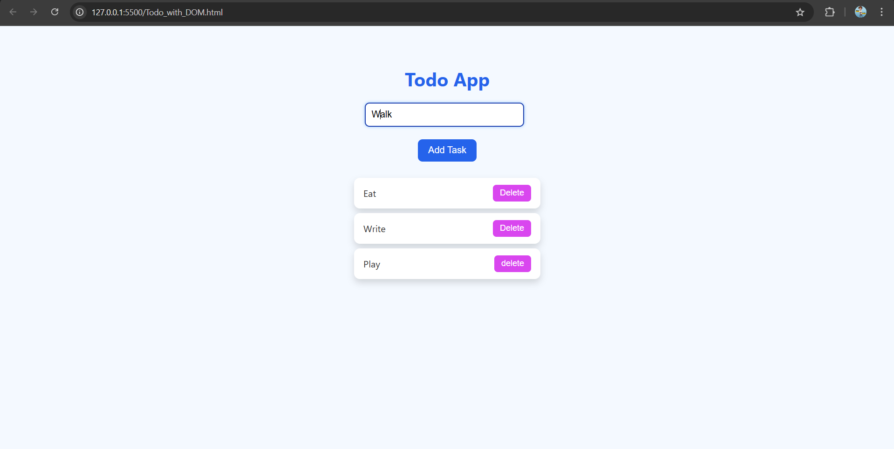

## To-Do App

A simple To-Do List application built with **HTML**, **CSS**, and **JavaScript**. This app allows users to:

- Add tasks
- Mark tasks as completed
- Delete tasks

## Features

- **Add Tasks**: Easily add new tasks to your to-do list.
- **Complete Tasks**: Mark tasks as completed with a single click.
- **Delete Tasks**: Remove tasks from your list when they're no longer needed.
- **Responsive Design**: Optimized for both desktop and mobile devices.

## Live Demo

https://sahilkadam078.github.io/To-Do-App/

## Screenshot

